# 🔍 Influencer Honesty Score

A Data Analytics project that detects suspicious influencer engagement patterns using a custom-built Honesty Risk Score and a complete analytics pipeline — including correlation analysis, visualizations, business insights, executive reporting, and an interactive Plotly Dash dashboard.

---

## 🎯 Problem Statement

Brands spend millions on influencer marketing, but many influencer accounts contain fake followers, bot-generated engagement, and inflated metrics.

This project helps identify suspicious influencers by analyzing engagement behavior and calculating a transparent, explainable **Honesty Risk Score** ranging from 0 to 100.

> **Higher Score = Higher Risk of Fake Engagement**

---

## 🚀 Features

### Core Scoring Engine
- Engagement Rate Analysis
- Follower-Following Ratio Analysis
- Like-to-Comment Ratio Analysis
- Audience Quality Assessment
- Honesty Risk Score Calculation

### Analytics Layer
- Data Quality Auditing
- Correlation Analysis
- Statistical Insights
- Automated Business Insights
- Executive Summary Generation

### Interactive Dashboard
- Executive Overview
- Rankings Dashboard
- Correlation Analysis
- Visual Analytics
- Business Insights

---

## 📊 Key Findings

- 45% of analyzed accounts were flagged as **HIGH RISK**.
- Average Honesty Risk Score: **63.7 / 100**.
- **Nano Influencers** (<50K followers) showed the highest average risk.
- **Mega Influencers** (1M+ followers) showed the lowest average risk.
- Like-Comment Ratio and Engagement Rate were the strongest indicators of suspicious activity.

---

## 🧮 Honesty Risk Score Formula

```text
Honesty Risk Score =
    (0.30 × Engagement Rate Deviation)
  + (0.20 × Follower-Following Ratio)
  + (0.25 × Like-to-Comment Ratio)
  + (0.25 × Audience Quality Score)
```

### Components

| Component | Weight | Purpose |
|---|---|---|
| Engagement Rate Deviation | 30% | Detect abnormal engagement |
| Follower-Following Ratio | 20% | Identify suspicious follower behavior |
| Like-to-Comment Ratio | 25% | Detect bot-like engagement |
| Audience Quality Score | 25% | Evaluate audience authenticity |

---

## 📈 KPI Definitions

| KPI | Description |
|---|---|
| Engagement Rate | Audience interaction relative to followers |
| Follower-Following Ratio | Influencer authority indicator |
| Like-Comment Ratio | Bot detection metric |
| Honesty Risk Score | Overall fake engagement risk |
| Risk Label | LOW / MEDIUM / HIGH |
| Follower Tier | Nano / Micro / Macro / Mega |

---

## 🏗️ Project Architecture

```text
Data Collection
      ↓
Data Processing
      ↓
Honesty Score Calculation
      ↓
Correlation Analysis
      ↓
Visualization Generation
      ↓
Business Insights
      ↓
Executive Reporting
      ↓
Interactive Dashboard
```

---

## 🔄 Workflow

### Step 1: Data Collection
```bash
python src/youtube_collector.py
```
**Output:** `data/raw/influencers_raw.csv`

### Step 2: Calculate Honesty Scores
```bash
python src/scorer.py
```
**Output:** `data/processed/influencers_scored.csv`

### Step 3: Run Analytics Pipeline
```bash
python analytics/run_analytics.py
```
**Generates:**
- Reports
- Visualizations
- Correlation Matrix
- Business Insights

### Step 4: Launch Dashboard
```bash
python dashboard/app.py
```
**Dashboard:** http://127.0.0.1:8050

---

## 📸 Dashboard Screenshots

### 📈 Executive Overview
Interactive KPI dashboard showing:
- Influencers Analyzed
- High Risk Accounts
- Authentic Accounts
- Average Honesty Risk Score
- Risk Distribution
- Follower Tier Analysis


### 🏆 Rankings Dashboard
View rankings from most authentic to most suspicious influencers.

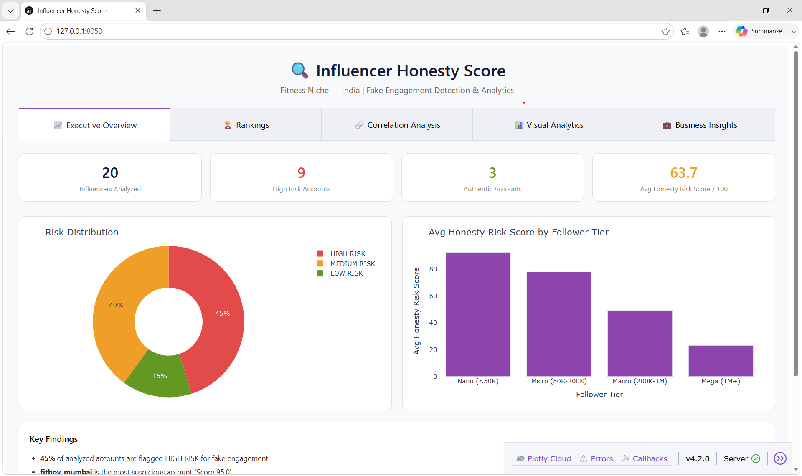

### 🔗 Correlation Analysis
Explore relationships between metrics using heatmaps and scatter plots.

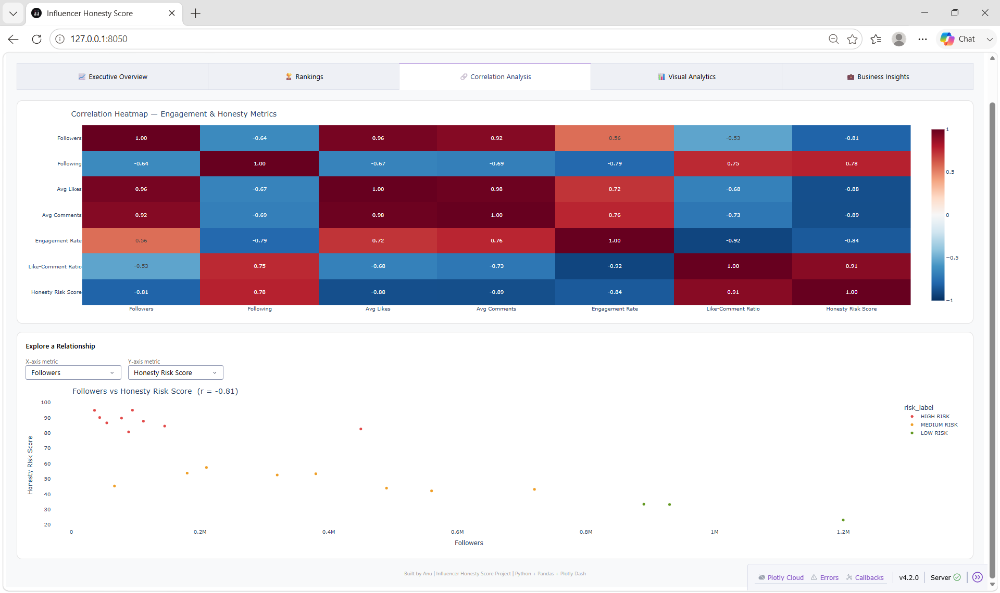

### 📊 Visual Analytics
Comprehensive visualization suite for deeper analysis.

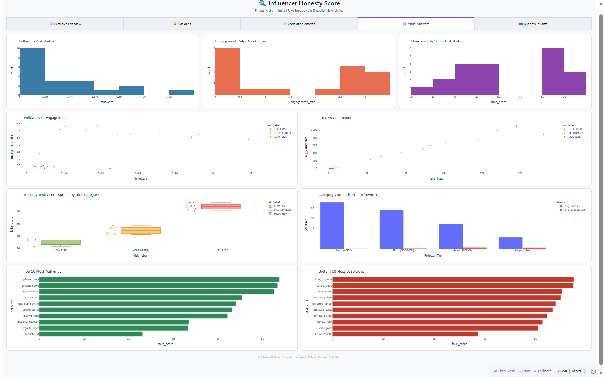

### 💼 Business Insights
Decision-ready insights for brands and influencer marketing teams.

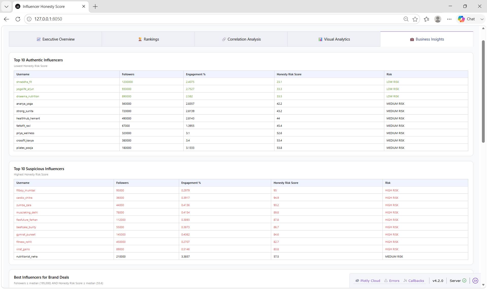
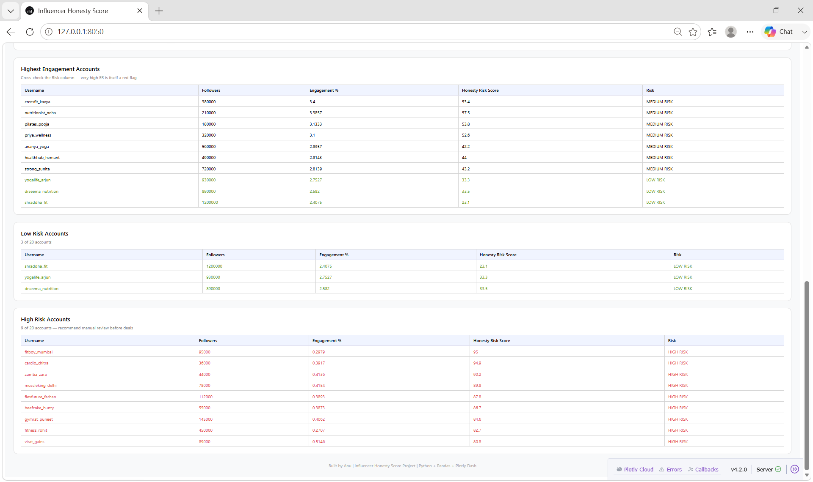

---

## 📊 Generated Visualizations

| Visualization | Preview |
|---|---|
| Correlation Heatmap | 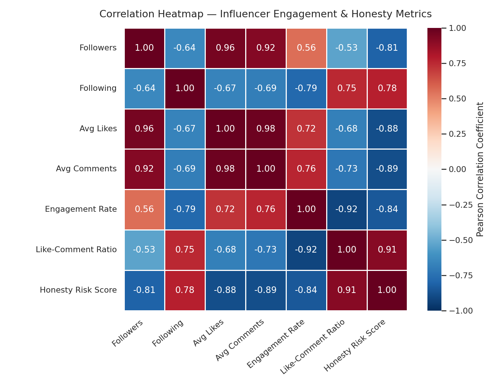 |
| Followers Distribution | 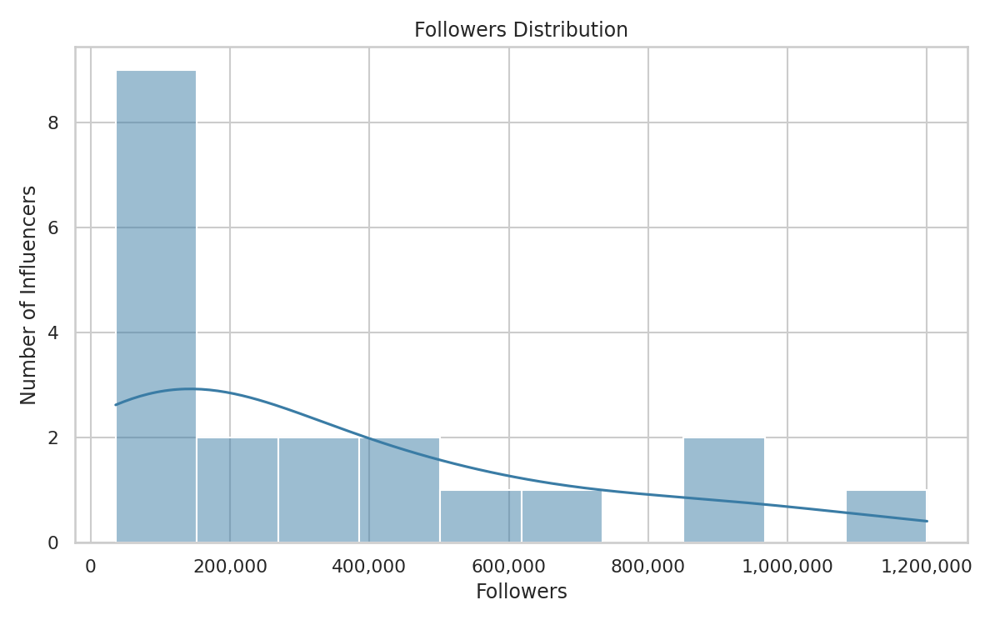 |
| Engagement Rate Distribution | 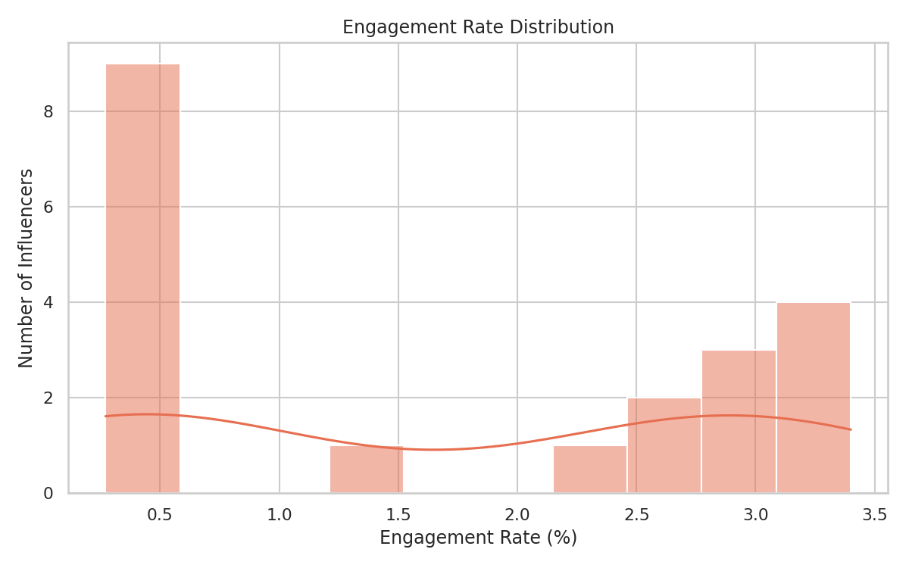 |
| Honesty Score Distribution | 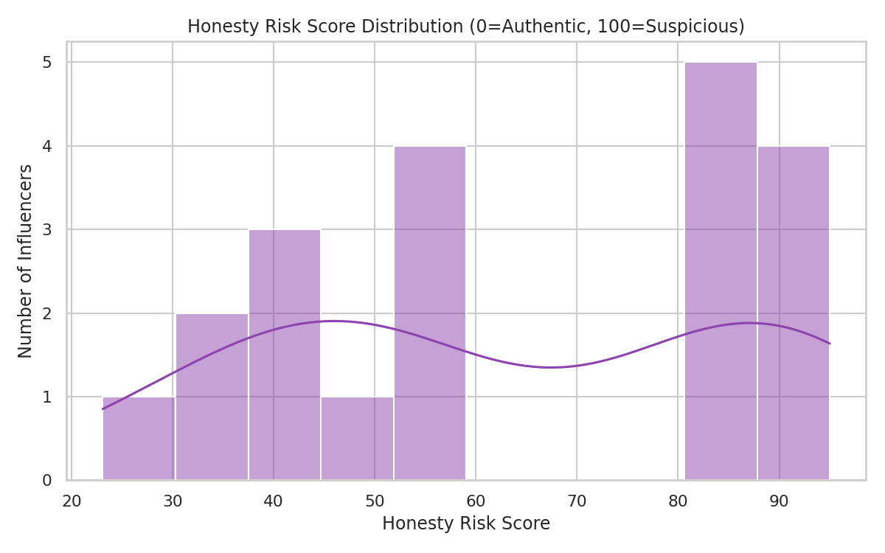 |
| Followers vs Engagement | 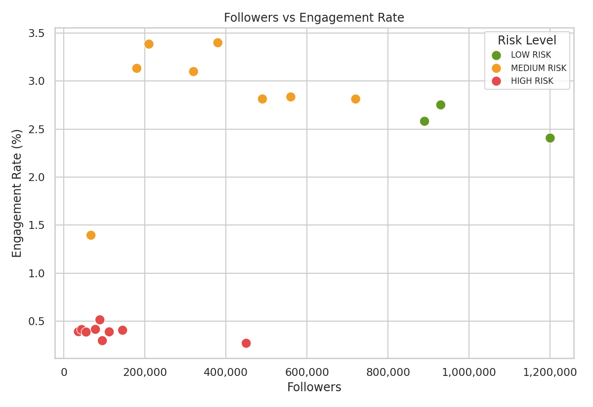 |
| Likes vs Comments | 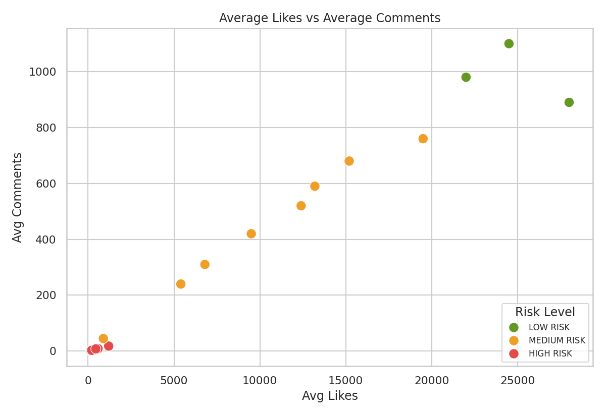 |
| Risk Category Analysis | 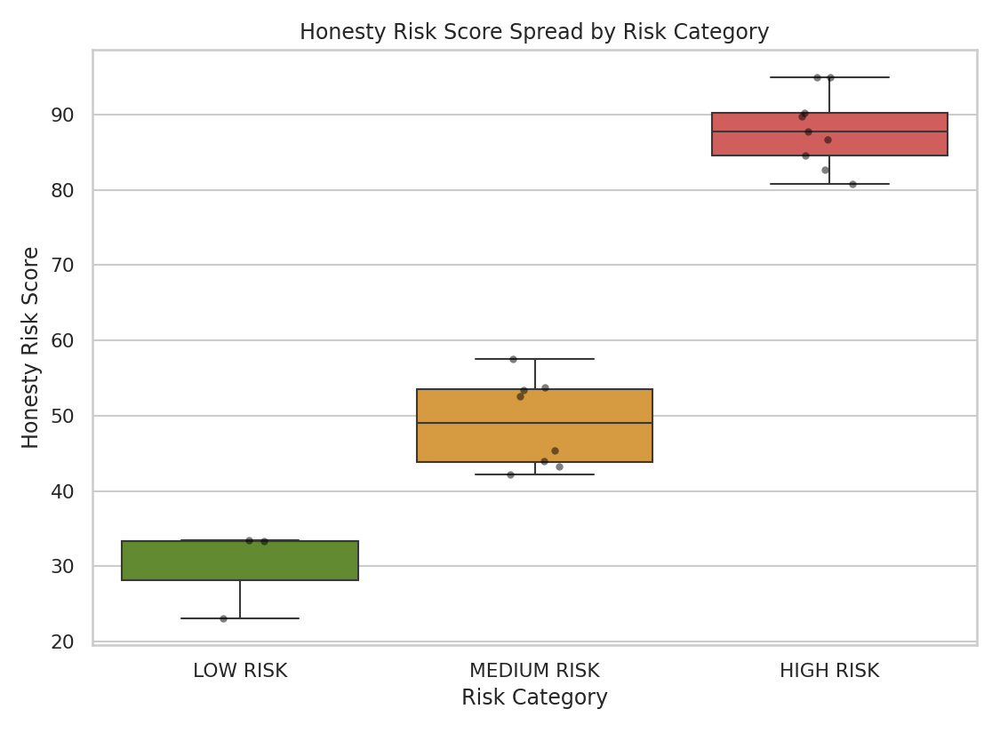 |
| Top 10 Most Authentic Influencers | 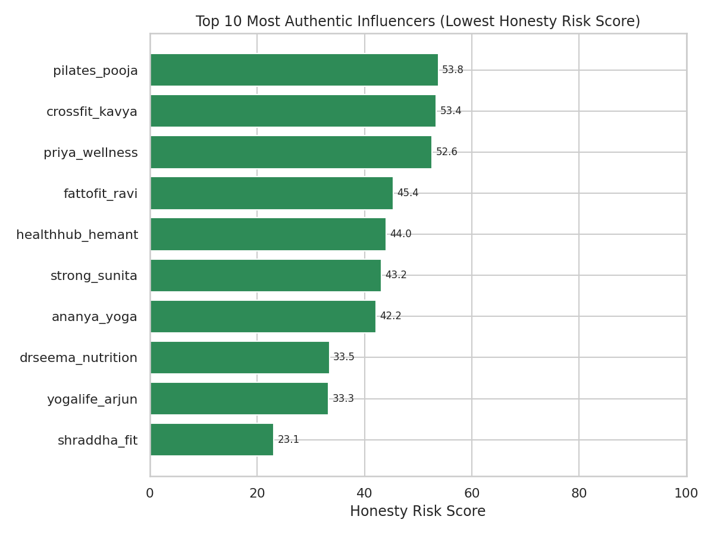 |
| Top 10 Most Suspicious Influencers | 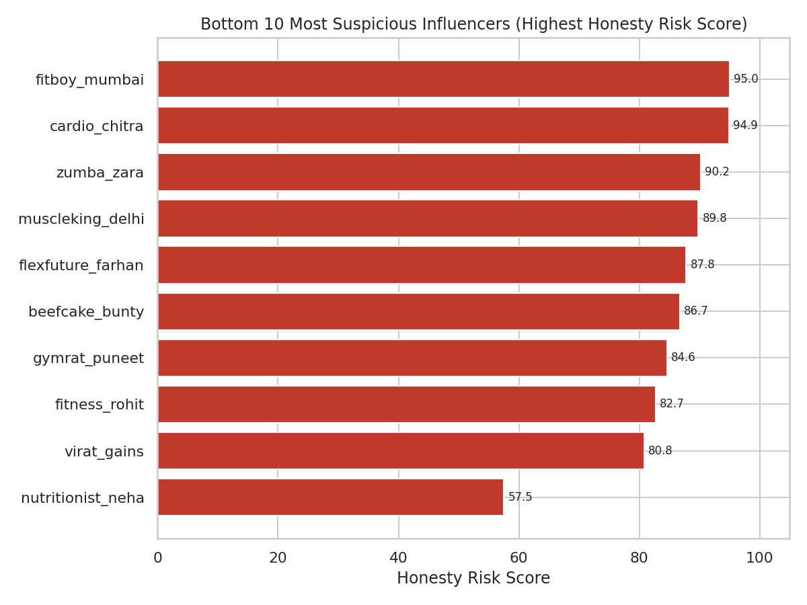 |
| Follower Tier Comparison | 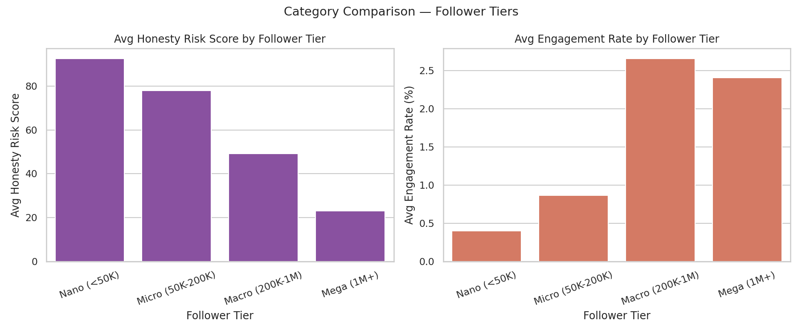 |

---

## 📁 Dataset

A curated sample dataset of fitness influencers is included for demonstration and analytics purposes.

**Dataset fields include:**
- Followers
- Following
- Average Likes
- Average Comments
- Engagement Rate
- Like-to-Comment Ratio
- Audience Quality Score
- Honesty Risk Score
- Risk Label
- Follower Tier

---

## 💼 Business Use Cases

### Influencer Marketing Agencies
- Screen influencer candidates
- Detect suspicious engagement
- Reduce marketing risk

### Brand Marketing Teams
- Select authentic influencers
- Improve sponsorship ROI
- Optimize campaign spending

### Data Analytics Portfolio
Demonstrates:
- Data Cleaning
- Feature Engineering
- KPI Development
- Correlation Analysis
- Data Visualization
- Business Intelligence
- Dashboard Development

---

## 🛠️ Tech Stack

| Category | Tools |
|---|---|
| Programming | Python |
| Data Analytics | Pandas, NumPy |
| Visualization | Matplotlib, Seaborn, Plotly |
| Dashboard | Dash |
| Data Collection | YouTube Data API |

---

## 📂 Project Structure

```text
influencer-honesty-score/
│
├── analytics/
├── dashboard/
├── data/
├── reports/
├── screenshots/
├── visualizations/
├── src/
│
├── README.md
├── requirements.txt
└── .gitignore
```

---

## ⚙️ Installation

**1. Clone repository**
```bash
git clone https://github.com/YOUR_USERNAME/influencer-honesty-score.git
```

**2. Move into project**
```bash
cd influencer-honesty-score
```

**3. Create virtual environment**
```bash
python -m venv venv
```

**4. Activate environment**

Windows:
```bash
venv\Scripts\activate
```

Linux / Mac:
```bash
source venv/bin/activate
```

**5. Install dependencies**
```bash
pip install -r requirements.txt
```

---

## 🎓 Learning Outcomes

This project demonstrates:
- Data Collection
- Data Cleaning
- Feature Engineering
- KPI Design
- Statistical Analysis
- Correlation Analysis
- Data Visualization
- Business Intelligence
- Dashboard Development
- Report Generation

---

## 👩‍💻 Author

**Anusha Thotakura**
B.Tech Computer Science Engineering (2026)

Interested in:
- Data Analytics
- Business Intelligence
- Data Visualization
- Full Stack Development